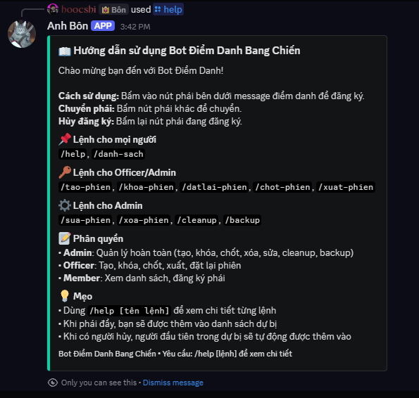
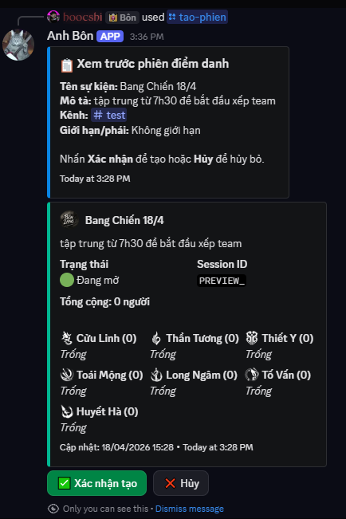
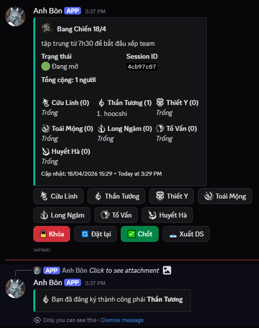

# 🎮 BANG CHIEN BOT - Hướng Dẫn Sử Dụng

Bot Discord để điểm danh thành viên tham gia bang chiến.

## Mục Lục

1. [Tổng Quan](#tổng-quan)
2. [Cài Đặt](#cài-đặt)
3. [Cấu Hình](#cấu-hình)
4. [Chạy Bot](#chạy-bot)
5. [Sử Dụng Trong Discord](#sử-dụng-trong-discord)
6. [Database Schema](#database-schema)
7. [Kiến Trúc Code](#kiến-trúc-code)
8. [Docker](#docker)
9. [Tests](#tests)
10. [Giải Quyết Vấn Đề](#giải-quyết-vấn-đề)

---

## Tổng Quan

### Giới Thiệu

Bot điểm danh bang chiến giúp bang hội/game quản lý danh sách thành viên tham gia, với các tính năng:

- ✅ Tạo phiên điểm danh bằng slash command với **preview trước khi tạo**
- ✅ Đăng ký/hủy/chuyển phái bằng button với **pagination**
- ✅ Cập nhật realtime khi có người bấm (có debounce để tránh spam API)
- ✅ 7 phái: Cửu Linh, Thần Tướng, Thiết Y, Toái Mộng, Long Ngâm, Tố Vấn, Huyết Hà
- ✅ Khóa/mở/khóa phiên bằng admin
- ✅ Xuất danh sách theo nhiều định dạng (Discord, CSV, **Google Sheets**)
- ✅ **DM notification** cho user khi phiên chốt/reset/khóa
- ✅ Audit log đầy đủ mọi thao tác
- ✅ Chống spam & debounce, **rate limit slash commands**
- ✅ **Phân quyền 3 cấp**: Admin > Officer > Member
- ✅ **Auto-lock** + **persistence timer** (không mất timer khi restart)
- ✅ **Backup tự động** theo cron schedule
- ✅ **Xóa người rời guild** khỏi danh sách
- ✅ **Docker** deploy & **Vitest** test coverage

### Stack

- **Runtime:** Node.js >= 20
- **Discord.js:** v14 (ES Modules)
- **Database:** SQLite (better-sqlite3) với WAL mode
- **DateTime:** luxon
- **Test:** Vitest v2
- **Deploy:** Docker + Docker Compose

## Preview
### Tổng quan bot


### Tạo phiên điểm danh


### Đăng ký bằng button


---

## Cài Đặt

### Yêu Cầu

- Node.js 20+
- npm hoặc yarn

### Bước 1: Clone/Copy Project

```bash
cd c:/Users/mcdro/Downloads/botdiemdanh
```

### Bước 2: Cài Đặt Dependencies

```bash
npm install
```

### Bước 3: Tạo File .env

```bash
copy .env.example .env
```

Sau đó chỉnh sửa file `.env` với các thông số cần thiết:

```env
DISCORD_BOT_TOKEN=your_bot_token_here
BOT_OWNER_ID=your_user_id
ADMIN_ROLE_IDS=role_id_1,role_id_2
OFFICER_ROLE_IDS=role_id_1,role_id_2
DB_PATH=./data/botdiemdanh.db
LOG_LEVEL=info
TIMEZONE=Asia/Ho_Chi_Minh
AUTO_LOCK_MINUTES=0
MAX_PER_FACTION=0
DEBOUNCE_MS=1000
```

### Bước 4: Lấy Discord Bot Token

1. Vào [Discord Developer Portal](https://discord.com/developers/applications)
2. Tạo Application mới
3. Vào tab **Bot**
4. Copy **Token** vào `DISCORD_BOT_TOKEN`
5. Bật các Intent:
   - `SERVER MEMBERS INTENT`
   - `MESSAGE CONTENT INTENT`
6. Tất cả các Slash Commands sẽ tự động register khi bot khởi động

---

## Cấu Hình

### Phân Quyền 3 Cấp

| Cấp | Quyền |
|-----|-------|
| **Admin** | Tất cả quyền (tạo, khóa, chốt, xuất, đặt lại, sửa, xóa, cleanup, backup) |
| **Officer** | Tạo, khóa, chốt, xuất, đặt lại phiên |
| **Member** | Xem danh sách, đăng ký phái |
| **Bot Owner** | Quyền cao nhất (bất kể có trong danh sách hay không) |

| Biến | Mô Tả |
|-------|-------|
| `BOT_OWNER_ID` | User ID của chủ bot - tự động có mọi quyền |
| `ADMIN_ROLE_IDS` | Danh sách Role ID có quyền Admin (cách nhau dấu phẩy) |
| `OFFICER_ROLE_IDS` | Danh sách Role ID có quyền Officer (cách nhau dấu phẩy) |

### Tìm Role ID

1. Bật Developer Mode trong Discord (Settings > Advanced > Developer Mode)
2. Click chuột phải vào Role > Copy Role ID

### Hành Vi

| Biến | Mặc Định | Mô Tả |
|-------|-----------|-------|
| `AUTO_LOCK_MINUTES` | 0 | Phút trước/sau giờ hết hạn để tự động khóa. 0 = tắt |
| `MAX_PER_FACTION` | 0 | Số người tối đa mỗi phái. 0 = không giới hạn |
| `DEBOUNCE_MS` | 1000 | Khoảng cách tối thiểu giữa 2 thao tác cùng user (ms) |
| `LOG_LEVEL` | info | debug/info/warn/error |

### Rate Limit Slash Commands

| Biến | Mặc Định | Mô Tả |
|-------|-----------|-------|
| `SLASH_RATE_LIMIT_COUNT` | 5 | Số lệnh tối đa mỗi user trong cửa sổ thời gian |
| `SLASH_RATE_LIMIT_WINDOW_MS` | 30000 | Cửa sổ thời gian rate limit (ms) |

### Backup Tự Động

| Biến | Mặc Định | Mô Tả |
|-------|-----------|-------|
| `AUTO_BACKUP_ENABLED` | false | Bật/tắt backup tự động |
| `BACKUP_CRON_SCHEDULE` | 0 3 * * * | Cron schedule (3h sáng hàng ngày) |
| `BACKUP_RETENTION_COUNT` | 7 | Số bản backup giữ lại |
| `BACKUP_DIR` | ./backups | Thư mục chứa backup |

### Google Sheets (Tùy Chọn)

| Biến | Mô Tả |
|-------|-------|
| `GOOGLE_APPLICATION_CREDENTIALS` | Đường dẫn file credentials.json từ Google Cloud |
| `GOOGLE_SHEET_ID` | ID của Google Sheet (từ URL) |
| `GOOGLE_SHEET_NAME` | Tên sheet để xuất (mặc định: Sheet1) |

---

## Chạy Bot

### Chế Độ Phát Triển (Tự Động Restart Khi Có Thay Đổi)

```bash
npm run dev
```

### Chế Độ Production

```bash
npm start
```

### Khởi Tạo Database (Tự Động Chạy Khi Start)

Database tự động được tạo khi bot khởi động. Nếu cần reset:

```bash
npm run db:init
```

---

## Sử Dụng Trong Discord

### Lệnh Cho Mọi Người

**Command:** `/help`
```
/help
```
Xem hướng dẫn sử dụng và danh sách lệnh. Dùng `/help [tên lệnh]` để xem chi tiết.

**Command:** `/danh-sach`
```
/danh-sach trangthai:Tat ca
```

### Lệnh Cho Officer/Admin

| Lệnh | Mô Tả |
|------|-------|
| `/tao-phien` | Tạo phiên điểm danh mới (có preview trước khi tạo) |
| `/khoa-phien` | Khóa hoặc mở khóa phiên |
| `/datlai-phien` | Xóa toàn bộ danh sách (giữ phiên) |
| `/chot-phien` | Chốt đóng phiên, không cho đăng ký nữa |
| `/xuat-phien` | Xuất danh sách |

> Định dạng xuất: `Theo phái`, `Tổng quan`, `Đặc biệt (Zalo/Facebook)`, `Chi tiết`, `File CSV`, **`Google Sheets`**

### Lệnh Cho Admin

| Lệnh | Mô Tả |
|------|-------|
| `/sua-phien` | Thêm/xóa thành viên thủ công |
| `/xoa-phien` | Xóa phiên đã chốt |
| `/cleanup` | Xóa người đã rời guild khỏi danh sách |
| `/backup` | Sao lưu database |

```
/cleanup              # Kiểm tra + xóa người đã rời
/cleanup hanhdong:Kiem tra  # Chỉ kiểm tra, không xóa
```

```
/backup              # Tạo backup ngay
/backup hanhdong:Xem danh sach  # Xem danh sách backup
```

### Admin Buttons Trên Message

Khi tạo phiên, message sẽ có các nút:

| Nút | Chức Năng |
|-----|-----------|
| 🔒 Khoa | Khóa phiên |
| 🔓 Mo Khoa | Mở khóa phiên (khi đã khóa) |
| 🔄 Reset | Reset toàn bộ danh sách |
| ✅ Chot Dong | Chốt đóng phiên |
| 📤 Xuat DS | Xuất danh sách |
| 🗑️ Xoa Phien | Xóa phiên (chỉ khi đã chốt) |

### Pagination Buttons

Khi một phái có nhiều thành viên, sẽ có nút phân trang:

| Nút | Chức Năng |
|-----|-----------|
| ◀️ Trang truoc | Xem trang trước |
| Trang sau ▶️ | Xem trang tiếp theo |

---

## Database Schema

### Bảng `sessions`

| Cột | Kiểu | Mô Tả |
|-----|------|-------|
| id | TEXT (PK) | UUID phiên |
| name | TEXT | Tên sự kiện |
| description | TEXT | Mô tả |
| start_time | TEXT | ISO timestamp bắt đầu |
| end_time | TEXT | ISO timestamp kết thúc |
| notify_channel_id | TEXT | Kênh thông báo |
| guild_id | TEXT | Server ID |
| guild_name | TEXT | Tên server |
| channel_id | TEXT | Kênh gửi message |
| message_id | TEXT | Message ID của embed |
| status | TEXT | open/locked/closed |
| created_by_id | TEXT | Người tạo ID |
| created_by_name | TEXT | Người tạo name |
| max_per_faction | INT | Giới hạn mỗi phái |
| locked_at | TEXT | Timestamp khóa |
| locked_by_id | TEXT | Người khóa ID |
| locked_by_name | TEXT | Người khóa name |
| closed_at | TEXT | Timestamp đóng |
| closed_by_id | TEXT | Người đóng ID |
| closed_by_name | TEXT | Người đóng name |
| created_at | TEXT | Timestamp tạo |
| updated_at | TEXT | Timestamp cập nhật cuối |

### Bảng `registrations`

| Cột | Kiểu | Mô Tả |
|-----|------|-------|
| id | INTEGER (PK) | Auto increment |
| session_id | TEXT (FK) | Phiên ID |
| user_id | TEXT | Discord user ID |
| user_name | TEXT | Display name |
| faction_id | TEXT | Phái ID |
| registered_at | TEXT | Timestamp đăng ký |
| updated_at | TEXT | Timestamp cập nhật |

### Bảng `audit_log`

| Cột | Kiểu | Mô Tả |
|-----|------|-------|
| id | INTEGER (PK) | Auto increment |
| session_id | TEXT | Phiên ID |
| action | TEXT | register/unregister/switch/lock/... |
| actor_id | TEXT | Người thực hiện |
| actor_name | TEXT | Tên người thực hiện |
| target_user_id | TEXT | User bị tác động |
| target_user_name | TEXT | Tên user bị tác động |
| faction_from | TEXT | Phái cũ |
| faction_to | TEXT | Phái mới |
| extra_data | TEXT | JSON data phụ |
| created_at | TEXT | Timestamp |

---

## Kiến Trúc Code

```
src/
├── bot.js                    # Entry point, client, event handlers
├── config/
│   ├── index.js             # Cấu hình + ENV validation + schema
│   ├── factions.js          # Định nghĩa 7 phái
│   ├── constants.js         # Hằng số: trạng thái, button IDs, pagination
│   └── colors.js            # Màu sắc embeds
├── database/
│   ├── index.js             # Export repositories
│   ├── database.js          # SQLite wrapper (singleton) với transaction support
│   ├── schema.js            # CREATE TABLE statements
│   └── repositories/
│       ├── sessionRepository.js      # CRUD phiên
│       ├── registrationRepository.js   # CRUD đăng ký + waitlist
│       └── auditLogRepository.js       # Log thao tác
├── middleware/
│   └── permissions.js       # Phân quyền 3 cấp (admin/officer/member)
├── utils/
│   ├── logger.js            # Logger tập trung + error handler
│   ├── helpers.js           # Hàm tiện ích + UserDebouncer
│   ├── rateLimiter.js       # Sliding window rate limiter
│   ├── embedBuilder.js      # Tạo Discord embeds với pagination
│   └── buttonBuilder.js     # Tạo button components + pagination buttons
├── services/
│   ├── backupService.js     # Backup + restore + retention
│   ├── cleanupService.js    # Xóa người rời guild
│   └── sheetsService.js     # Google Sheets export
├── jobs/
│   └── scheduler.js         # Auto-backup + persistence timer
├── events/
│   ├── index.js             # Export event handlers
│   ├── guildMemberRemove.js  # Xử lý member leave
│   └── guildMemberAdd.js     # Xử lý member join
└── commands/
    └── slash/
        ├── tao.js           # Tạo phiên điểm danh (với preview)
        ├── ds.js            # Xem danh sách phiên
        ├── khoa.js          # Khóa / mở khóa phiên
        ├── datlai.js        # Đặt lại danh sách
        ├── chot.js          # Chốt đóng phiên
        ├── xuat.js          # Xuất danh sách
        ├── xoa.js           # Xóa phiên đã chốt
        ├── sua.js           # Sửa phiên thủ công
        ├── help.js          # Hướng dẫn sử dụng
        ├── cleanup.js       # Xóa người rời guild
        └── backup.js        # Sao lưu database
```

---

## Docker

### Docker Compose (Khuyến Nghị)

```bash
# 1. Copy .env
cp .env.example .env
# 2. Điền thông tin trong .env

# 3. Build và chạy
docker-compose up -d

# 4. Xem logs
docker-compose logs -f

# 5. Dừng bot
docker-compose down
```

### Docker Thủ Công

```bash
# Build image
docker build -t bang-chien-bot .

# Chạy
docker run -d \
  --name bang-chien-bot \
  --env-file .env \
  -v $(pwd)/data:/app/data \
  -v $(pwd)/logs:/app/logs \
  -v $(pwd)/backups:/app/backups \
  bang-chien-bot
```

### Đặc Điểm Docker

- Base image: `node:20-alpine`
- Rebuild `better-sqlite3` native binding
- Chạy as non-root user
- Health check interval 30s
- Mount volumes cho `data/`, `logs/`, `backups/`

---

## Tests

### Chạy Tests

```bash
# Chạy tất cả tests
npm test

# Chạy tests với watch mode
npm run test:watch

# Chạy tests với coverage
npm run test:coverage
```

### Các Test Hiện Có

| Test File | Mô Tả |
|-----------|-------|
| `tests/config.test.js` | Validation cấu hình, parse ENV |
| `tests/rateLimiter.test.js` | Sliding window algorithm |
| `tests/permissions.test.js` | Phân quyền 3 cấp |
| `tests/helpers.test.js` | Helper functions, debouncer |
| `tests/factions.test.js` | Faction config validation |

### Viết Thêm Tests

Tests nằm trong thư mục `tests/`. Tên file: `*.test.js`.

```javascript
import { describe, it, expect } from 'vitest';

describe('Ten module', () => {
  it('should do something', () => {
    expect(true).toBe(true);
  });
});
```

---

## Giải Quyết Vấn Đề

### Q: Bot không khởi động sau khi cập nhật?
A: Xóa `node_modules` và chạy `npm install` lại.

### Q: "Cannot find module 'better-sqlite3'"
A: Chạy `npm install` lại. Nếu lỗi trên Windows:
```bash
npm install --build-from-source
```

### Q: Slash commands không xuất hiện?
A:
1. Invite bot lại với quyền `Application Commands`
2. Đợi 1-2 phút để Discord sync commands

### Q: "You do not have permission"
A: Kiểm tra `ADMIN_ROLE_IDS` / `OFFICER_ROLE_IDS` trong `.env`.

### Q: Backup tự động không chạy?
A: Đặt `AUTO_BACKUP_ENABLED=true` trong `.env` và kiểm tra `BACKUP_CRON_SCHEDULE`.

### Q: Google Sheets không xuất được?
A: Đảm bảo đã enable Google Sheets API, tạo Service Account, và chia sẻ Sheet với email Service Account.

---

**Version:** 1.1.0
**Author:** Senior Discord Bot Engineer
**License:** MIT
